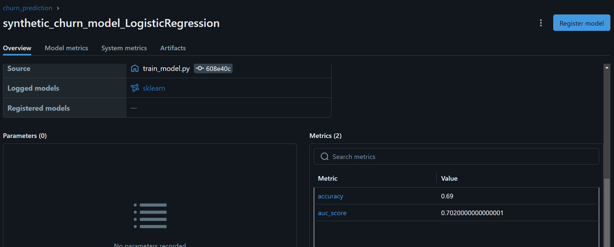
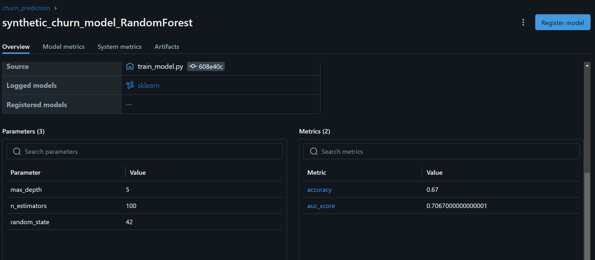

# Report

## Task 1

### LogisticRegression

Accuracy: 0.69

AUC Score: 0.7020000000000001

### RandomForest

Accuracy: 0.67

AUC Score: 0.7067000000000001

## Task 2

Using dataset from https://www.kaggle.com/datasets/mujtabamatin/air-quality-and-pollution-assessment

Honestly I don't really understand